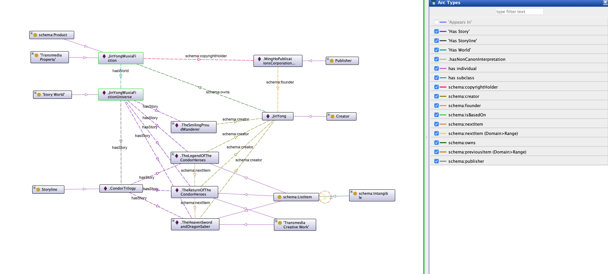

## Paper Swordsmen in the Web
---

With enterprises across movies, fiction, video game, and licensed merchandise, fictional “universes” such as the Marvel Universe are important market forces of our economy as well as an immerse system of narrative elements and signification.

The *Transmedia Fictional Worlds Ontology* (TFWO) developed by the GAMER Research Group at the University of Washington is an ontology that attempted to model two things.

1. Economically, it models the complex relation among creative works (individual stories, meta-storylines, adaptations) and agents (creators, contributors, copyright owners, and fans) of the transmedia fictional world system.

2. Culturally, it models the system of narrative elements and signification which drive the storylines.

Developed with materials from western creative works, namely Harry Potter, the Marvel Universe, Lord of the Rings, and Star Wars, TFWO is questionably geographically limited. *Paper Swordsmen in the Web* took the case of Jin Yong’s Wuxia Universe, a martial art fictional world created by the greatest Hong Kong novelist ever since the 1950s, to test the general applicability of TFWO.

## Specification of TFWO
---

TFWO is an OWL 2.0 model serialized in the RDF-XML format with 72 classes and 239 properties.

One of the design principles of TFWO is to be interoperable with relevant ontologies. Therefore, TFWO has imported four relevant ontologies, namely

1. Schema.org (for root classes)

2. Comic Book Ontology

3. Ontology of Astronomical Object Types Version 1.3 (for intergalactic / Sci-fi works)

4. SKOS (for management concepts).

## Research Methodology and Material
---

### Domain Analysis 

Two major sources of material are consulted for domain analysis.

1. The author of this paper who is also a fan of Jin Yong’s wuxia fiction. The author is particularly familiar with the *Condor Trilogy*, *Demi- Gods and Semi-Devils*, and *The Smiling, Proud Wanderer*.

2. Fan-driven sites, wikis, and databases as well as the relevant Wikipedia and Wikidata pages. These sources provided excellent ready-made classification (such as place, martial art types, and characters), description, and English translation of narrative elements with examples.

### Encoding

The result of domain analysis is then translated and entered into spreadsheet set out by Branch et al. Hundreds of classes and properties are created and subjected to comparison with the vocabularies in TFWO.

During the comparison process, nuances and differences between wuxia fiction elements and TFWO vocabularies are documented with the concept from SKOS (Simple Knowledge Organization System), namely board match, exact match, narrower match, related match, and close match.

### RDFS Conversion Test

After the coding stage, the theoretical data model is experimented in [Protégé](https://protege.stanford.edu/).

### Encoding Concern

To aggregate fictional worlds across culture and medium, the encoding sought to instantiate culturally specific terms with generic concept. (e.g. Yin and Yang as an individual / instance of Negative and Positive Energy)

## Result
---

### Encoding Example

Representation of *Heaven and Earth Great Shift* (fictional martial art skill).

Representation of *Five Elements Fists* (martial art skill created using an alternate version of real thing).

Crosslinking fictional universe by a proxy parent class *Air*. The *Force* in Star Wars has been viewed as an inspiration of the martial art *Qi* in many *fans interpretation*.

Representation of copyright and authorship metadata of Jin Yong's fictional universe. 

Knowledge graph expanded from intercultural lovers Zhang Wuji (Han Chinese) and Zhao Min (Mongol). The graph positioned elements according to the geolocation of  'real things': To the west: Persian cluster. To the North: Mongol cluster. To the South: Han cluster.

### Discussion

1. **Flat Structure and Repeating Appearances.**  There are generic concepts in wuxia fiction that reappear across individual creative works by the same or different authors, such as the martial art sects. On the one hand, in each appearance, these martial art sects may have different relations to other sects or a different leader. On the other hand, certain attributes of these sects will remain, such as having the same location or practicing the same religion. The lack of event-based representation (e.g. those of CIDOC CRM) limited the potential of TFWO.

2. **Linking Alternate Real Thing with LOD.** There is a problem in the combined use of owl:sameAs and ‘Alternate Version Of Real Thing’ as owl:sameAs indicates that two URI references actually refer to the same thing’ and there is no room for alternation. A possible alternative is to owl:sameAs is schema:isBasedOn.

3. **Connecting Culture, Naming People.** One of the key characteristics of Jin Yong’s historical wuxia fiction is the dramatic narration of the love and hate between Han Chinese and the surrounding ethnic groups. For example, Jin Yong  created a Mongol name for Zhao Min (Minmin Temür), the Mongolian princess and the female patroganist in *The Heaven Sword and the Dragon Saber*. In TFWO, there are only two group of properties - TFWO:dominantName/rdfs:label and the subproperties of schema:alternateName. If Zhao Min occupied TFWO:dominantName/rdfs:label because it is the name recognizable by the audience of Jin Yong, we cannot put Minmin Temür as TFWO:alias/schema:alternateName because semantically it does not convery the sense of "original name". The lack of multilingual awareness undermines TFWO's practicability of multicultural aggregation.

| Property  | Definition |Subproperty Of|Definition|
| ------------- | ------------- |-------------|-|
| TFWO:dominantName  | The Name of a Thing.  |rdfs:label|a human-readable version of a resource's name.|
| TFWO:alias  | An Alias used for this Thing.  |schema:alternateName|An alias for the item.|
| TFWO:heroicOrVillainousName  | An Alias used for this Thing.  |schema:alternateName|An alias for the item.|
|TFWO:secretIdentity|The secret name for a Thing.|schema:alternateName|An alias for the item.|
|X|X|schema:name|The name of the item.|

4. **Vocabulary Accuracy and Sufficiency.** Additional sub-classes and sub-properties are added to represent martial arts sects, martial arts combat skill, and Wuxia salutation.

## Conclusion
---
TFWO strives to achieve two objectives, namely modeling the complex relation among creative works and the agents, as well as the system of narrative elements and signification which drive the storylines. The case of Jin Yong’s wuxia fiction world proves that TFWO is a good performer in the former. While for the latter, the lack of vocabulary (such as the classes for martial arts and martial art sects) is also not a problem as they can be easily created as an importable extension.

The potential of TFWO lies in its ability to aggregate fictional worlds across culture, media, and time, which in turn enable SPARQL query or AI-reasoning. For example, it is claimed that Genghis Khan is one of the most frequently appeared real person in historical fiction. If we can link real things via LOD, we may inspect, visualize the connection across the barrier of language and media to see the psychogeography of fictional worlds.

The ‘Minmin Temür’ case reveals the tension between humanities and computing. Schema.org is not intended to model complex humanities problems. If one intends to gain benefit from Schema.org’s search engine interoperability, one has to compromise losing certain nuance.
